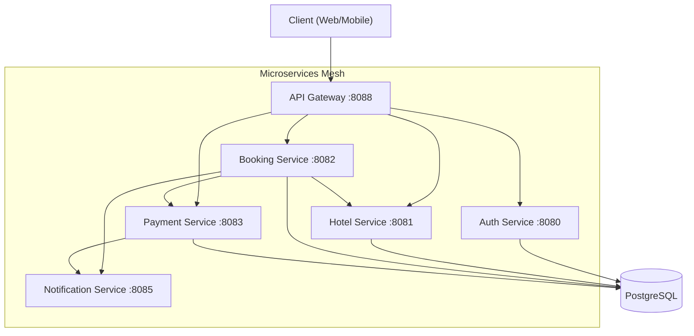
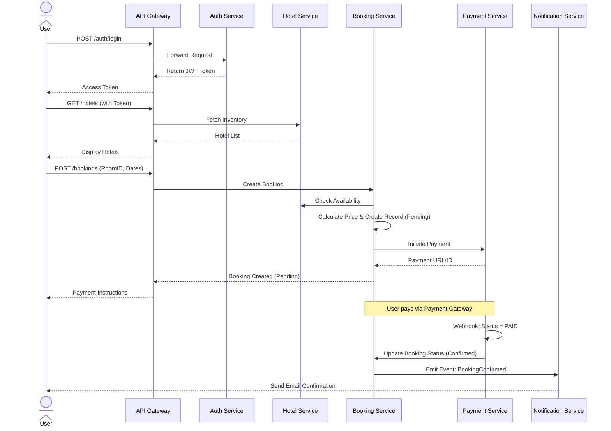

# Hotel Booking Microservices Platform

[](https://golang.org/doc/go1.23)
[](docs/architecture-review.md)
[](LICENSE)

> **A production-grade, backend-only hotel booking system demonstrating advanced Domain-Driven Design (DDD) and SOLID principles in Go.**

This platform is decomposed into **six microservices** behind an API Gateway, featuring a robust event-driven architecture, payment abstraction, and comprehensive documentation.

---

## 📚 Documentation Hub

| Document | Description |
|----------|-------------|
| **[🏗️ Project Structure](docs/project-structure.md)** | Detailed breakdown of folders, layers, and key files. |
| **[📐 Architecture Review](docs/architecture-review.md)** | Design decisions, patterns, and architectural principles. |
| **[🗺️ Entity Analysis](docs/entity-analysis.md)** | Database schema, entities, and business rules. |
| **[🔗 ER Diagram](docs/ERD.md)** | Visual representation of database relationships. |
| **[📖 Glossary](docs/glossary.md)** | Ubiquitous Language definitions. |
| **[🔌 API Swagger](docs/swagger/swagger.yaml)** | OpenAPI 3.0 specification. |

---

## 🏛️ Architecture Overview

The system follows a **Microservices Architecture** with a **Clean Architecture** internal structure for each service.



**Bounded contexts & responsibilities**

| Service           | Port | Responsibilities                                                                                   |
|-------------------|------|----------------------------------------------------------------------------------------------------|
| **API Gateway**   | 8088 | JWT verification, rate limiting, reverse proxy, booking+payment aggregation                        |
| **Auth Service**  | 8080 | Register/login, password hashing (bcrypt), JWT issuing, `/register /login /me`                     |
| **Hotel Service** | 8081 | CRUD hotels, room types, rooms, public listing with room type summaries                             |
| **Booking Service**| 8082 | Booking lifecycle (create → pending → confirmed → checked_in → completed), cancellations, check-ins|
| **Payment Service**| 8083 | PaymentProvider abstraction (mock Xendit), initiation, webhook verification, refunds, booking sync |
| **Notification**  | 8085 | Simple dispatcher (zap logger), triggered on booking creation or payment events                    |

---

## 🔄 System Flow & User Journey

The following sequence diagram illustrates the core **Booking & Payment Workflow**, demonstrating how services interact to complete a reservation.



---

## 🚀 Tech Stack & Key Features

### Core Technology
- **Language**: Go 1.23
- **Frameworks**: chi router, sqlx/gorm, jwt v5, zap logger
- **Database**: PostgreSQL 15 (with `uuid-ossp`)
- **Containerization**: Docker + docker-compose (multi-stage builds)
- **Docs**: Swagger generated from handler annotations (`docs/swagger/swagger.yaml`)

### 🌟 Advanced DDD Features (New!)
- **Domain Events**: Full event sourcing capability (`pkg/domain/events.go`).
- **Rich Domain Models**: Business logic encapsulated in Aggregates (`Booking.Confirm()`, `Booking.GuestCheckIn()`).
- **Value Objects**: Powerful `Money` and `DateRange` types with validation and arithmetic.
- **CQRS Interfaces**: Split `BookingReader` and `BookingWriter` repositories.
- **Specification Pattern**: Complex filtering logic (`pkg/domain/specification.go`).
- **Domain Services**: `PricingService` for complex calculation logic.
- **Repository Factory**: Abstracted repository creation.

### Non-functional
- JWT-based authentication & role checks
- Rate limiting middleware on gateway
- Structured logging + context-aware logging helpers
- Config via environment variables (`.env.example`)
- Graceful shutdown using context cancellation & signal handling
- Payment provider abstraction + mock Xendit signature validation
- Consistent API error contract (DTO-based)

---

## 📐 API Shape (Assemblers, Domain-First, Pagination)

- **Thin Handlers**: DTO → inbound assembler → usecase (domain) → outbound assembler → DTO envelope.
- **Domain-Centric**: Usecases return domain models; mapping to DTO only happens at the handler boundary.
- **Pagination**: List endpoints accept `limit`/`offset` (default limit 50) in hotel, booking, auth, notification.
- **Validation**: Booking/Payment/Notification requests are validated in assemblers (ID/date/money/webhook signature).

**Mock payment webhook signature generation:**
```bash
PAYLOAD='{"payment_id":"<uuid>","status":"paid"}'
SIG=$(printf '%s' "$PAYLOAD" | openssl dgst -sha256 -hmac "$PAYMENT_PROVIDER_KEY" -hex | awk '{print $2}')
curl -X POST http://localhost:8088/api/v1/payments/webhook \
  -H "Content-Type: application/json" \
  -d '{"payment_id":"<uuid>","status":"paid","signature":"'"$SIG"'"}'
```

---

## � Complete API Reference (For Testers)

### Base URL
```
http://localhost:8088/api/v1
```

### Authentication Endpoints

#### 1. Register User
```http
POST /auth/register
Content-Type: application/json

{
  "email": "user@example.com",
  "password": "SecurePass123!",
  "role": "customer"  // or "admin"
}
```

#### 2. Login
```http
POST /auth/login
Content-Type: application/json

{
  "email": "user@example.com",
  "password": "SecurePass123!"
}

Response:
{
  "data": {
    "access_token": "eyJhbGc...",
    "refresh_token": "eyJhbGc..."
  }
}
```

#### 3. Get User Profile
```http
GET /auth/me/{user_id}
Authorization: Bearer {token}
```

---

### Hotel Management Endpoints

#### 4. List Hotels (Public)
```http
GET /hotels?limit=10&offset=0
```

#### 5. Get Hotel by ID (Public)
```http
GET /hotels/{hotel_id}
```

#### 6. Create Hotel (Admin Only) 🔒
```http
POST /hotels
Authorization: Bearer {admin_token}
Content-Type: application/json

{
  "name": "Grand Hotel",
  "description": "Luxury hotel in city center",
  "address": "123 Main St, Jakarta"
}
```

#### 7. Update Hotel (Admin Only) 🔒 
```http
PUT /hotels/{hotel_id}
Authorization: Bearer {admin_token}
Content-Type: application/json

{
  "name": "Updated Grand Hotel",
  "description": "Updated description",
  "address": "Updated address"
}
```

#### 8. Delete Hotel (Admin Only) 🔒 
```http
DELETE /hotels/{hotel_id}
Authorization: Bearer {admin_token}
```

---

### Room Type Endpoints

#### 9. List Room Types (Public)
```http
GET /room-types?limit=10&offset=0
```

#### 10. Create Room Type (Admin Only) 🔒
```http
POST /room-types
Authorization: Bearer {admin_token}
Content-Type: application/json

{
  "hotel_id": "{hotel_id}",
  "name": "Deluxe Suite",
  "capacity": 2,
  "base_price": 1500000,
  "amenities": "WiFi, TV, AC, Minibar"
}
```

---

### Room Management Endpoints

#### 11. List Rooms (Public)
```http
GET /rooms?limit=10&offset=0
```

#### 12. Get Room by ID (Public) 
```http
GET /rooms/{room_id}
```

#### 13. Create Room (Admin Only) 🔒
```http
POST /rooms
Authorization: Bearer {admin_token}
Content-Type: application/json

{
  "room_type_id": "{room_type_id}",
  "number": "101",
  "status": "available"  // available, maintenance, occupied
}
```

#### 14. Update Room (Admin Only) 🔒 
```http
PUT /rooms/{room_id}
Authorization: Bearer {admin_token}
Content-Type: application/json

{
  "number": "102",
  "status": "maintenance"
}
```

#### 15. Delete Room (Admin Only) 🔒 
```http
DELETE /rooms/{room_id}
Authorization: Bearer {admin_token}
```

---

### Booking Endpoints

#### 16. Create Booking 🔒
```http
POST /bookings
Authorization: Bearer {token}
Content-Type: application/json

{
  "room_type_id": "{room_type_id}",
  "check_in": "2025-12-01",
  "check_out": "2025-12-05"
}
```

#### 17. List Bookings 🔒
```http
GET /bookings?limit=10&offset=0
Authorization: Bearer {token}
```

#### 18. Get Booking by ID 🔒
```http
GET /bookings/{booking_id}
Authorization: Bearer {token}
```

#### 19. Cancel Booking 🔒
```http
POST /bookings/{booking_id}/cancel
Authorization: Bearer {token}
```

#### 20. Check-in Booking 🔒
```http
POST /bookings/{booking_id}/checkin
Authorization: Bearer {token}
```

---

### Payment Endpoints

#### 21. Get Payment by Booking ID 🔒
```http
GET /payments/booking/{booking_id}
Authorization: Bearer {token}
```

#### 22. Payment Webhook (Provider Callback)
```http
POST /payments/webhook
Content-Type: application/json

{
  "payment_id": "{payment_id}",
  "status": "paid",
  "signature": "{hmac_signature}"
}
```

#### 23. Refund Payment (Admin Only) 🔒
```http
POST /payments/{payment_id}/refund
Authorization: Bearer {admin_token}
Content-Type: application/json

{
  "reason": "Customer request"
}
```

---

### Notification Endpoints

#### 24. List Notifications 🔒
```http
GET /notifications?limit=10&offset=0
Authorization: Bearer {token}
```

---

### Gateway Aggregation Endpoint

#### 25. Get Booking Aggregate 🔒
```http
GET /gateway/aggregate/bookings/{booking_id}
Authorization: Bearer {token}

Response: Combined data from booking, payment, and hotel services
```

---

### Legend
- 🔒 = Requires Authentication (JWT Bearer Token)
-  = Newly implemented endpoint
- **Admin Only** = Requires `role: "admin"` in JWT claims

### Auto-Checkout Feature 
- **Trigger**: Automatic CronJob (daily at 10:00 AM)
- **Process**: Bookings with `checkout_date = today` AND `status = checked_in` are automatically transitioned to `completed`
- **No API Call Required**: Fully automated background process

---

## �📂 Repository Layout

```
cmd/<service>/           # each service entry point (auth-service, booking-service, etc.)
internal/
  domain/<bounded>       # entities & repository interfaces
  usecase/<bounded>      # core business logic
  infrastructure/        # http handlers, repositories, provider clients, gateway logic
  usecase/<bounded>/assembler # inbound/outbound mapping DTO <-> domain
pkg/                     # shared libs (config, dto, middleware, logger, etc.)
migrations/001_init.sql  # SQL schema seed
build/<service>/Dockerfile
docs/                    # Swagger + ERD
```

---

## 🛠️ Configuration & Prerequisites

### Prerequisites
- Docker Desktop / Docker Engine 24+
- Docker Compose V2
- Go 1.23+ (only needed for local dev/tests)
- `swag` CLI (optional): `go install github.com/swaggo/swag/cmd/swag@latest`

### Environment Variables
Copy `.env.example` to `.env`:

| Variable | Default | Description |
|----------|---------|-------------|
| `DATABASE_URL` | `postgres://...` | Shared Postgres DSN |
| `JWT_SECRET` | `super-secret` | JWT signing secret |
| `PAYMENT_PROVIDER_KEY` | `sandbox-key` | HMAC key for mock Xendit |
| `RATE_LIMIT_PER_MINUTE` | `120` | Gateway rate limiter |

---

## ▶️ Running the Stack

1. **Spin up services**
   ```bash
   make run
   # OR
   docker-compose up --build
   ```
   - API Gateway: `http://localhost:8088/gateway`
   - Auth: `http://localhost:8080`
   - Hotel: `http://localhost:8081`
   - Booking: `http://localhost:8082`
   - Payment: `http://localhost:8083`
   - Notification: `http://localhost:8085`
   - PostgreSQL: `localhost:5432`
   - Adminer UI: `http://localhost:8089`

2. **Shutdown & cleanup**
   ```bash
   make down
   # OR
   docker-compose down -v
   ```

---

## 🗄️ Database & Migrations

- **Schema**: `migrations/001_init.sql` creates tables (`users`, `hotels`, `room_types`, `rooms`, `bookings`, `payments`, `refunds`, `checkins`).
- **UUIDs**: All keys use UUID (requires `CREATE EXTENSION "uuid-ossp"`).
- **Seeding**: Run `migrations/002_seed_data.sql` manually via Adminer to populate initial data.

---

## 📖 Swagger / API Documentation

1. **Generate docs**
   ```bash
   make swagger
   ```
   Produces `docs/swagger/swagger.yaml` & `docs/swagger/swagger.json`.

2. **Serve via swagger-ui** (optional)
   ```bash
   docker run --rm -p 8087:8080 \
     -e SWAGGER_JSON=/app/swagger.yaml \
     -v ${PWD}/docs/swagger/swagger.yaml:/app/swagger.yaml \
     swaggerapi/swagger-ui
   ```
   Visit `http://localhost:8087`.

**Swagger covers:**
- Auth `/register /login /me/{id}`
- Hotel `/hotels /room-types /rooms` (including full CRUD operations)
  - `GET /hotels` - List all hotels
  - `POST /hotels` - Create hotel (admin)
  - `GET /hotels/{id}` - Get hotel by ID
  - `PUT /hotels/{id}` - Update hotel (admin)
  - `DELETE /hotels/{id}` - Delete hotel (admin)
  - `GET /rooms` - List all rooms
  - `POST /rooms` - Create room (admin)
  - `GET /rooms/{id}` - Get room by ID 
  - `PUT /rooms/{id}` - Update room (admin) 
  - `DELETE /rooms/{id}` - Delete room (admin) 
- Booking `/bookings`, cancellation, checkpoint
  - Auto-checkout via CronJob (daily at 10:00 AM) 
- Payment `/payments`, `/payments/webhook`
- Notification `/notifications`
- Gateway `/gateway/aggregate/bookings/{id}`

### Auto-Checkout CronJob 
1. **Scheduler**: Runs daily at 10:00 AM (configurable via cron expression)
2. **Process**: 
   - Finds all bookings with `checkout_date = today` AND `status = checked_in`
   - Automatically transitions them to `completed` status
   - Publishes domain events for notification
3. **Configuration**: Implemented in `booking-service` using `robfig/cron/v3`
4. **Graceful Shutdown**: Scheduler stops cleanly when service terminates

---

## 🧪 Testing & Linting

```bash
make test     # go test ./... -cover
make lint     # go vet ./...
```

**Covered scenarios:**
- Booking creation: happy path, invalid dates, room type not found.
- Payment webhook: valid/invalid signature propagation.
- Refund flows: provider success/fail.
- Booking repository insert via sqlmock.

---

## 🌊 Service Flows

### Authentication
1. `POST /auth/register`: Email normalized, password hashed (bcrypt), role assigned.
2. `POST /auth/login`: Returns `access_token` + `refresh_token`.
3. **Protected requests**: Gateway checks `Authorization: Bearer <token>`.

### Hotel Inventory
1. **Admin Operations** (requires JWT with admin role):
   - Create, update, and delete hotels
   - Create, update, and delete rooms
   - Manage room types
2. **Public Operations** (no auth required):
   - List hotels and room types
   - Get hotel details by ID
   - Get room details by ID
3. **Soft Delete**: Delete operations use soft delete (data retained with deleted_at timestamp)
3. **Availability**: Booking service calls Hotel service for stock validation.

### Booking Lifecycle
1. `POST /bookings`: Validates dates/availability, calculates price, sets status `pending_payment`.
2. `PATCH /bookings/{id}/cancel`: Allowed only while pending; blocked after confirmed/checked_in/completed.
3. `POST /bookings/{id}/checkin`: Transitions to `checked_in`.

### Payment + Refund
1. `POST /payments`: Initiates payment via mock provider, returns URL.
2. `POST /payments/webhook`: Validates HMAC, updates payment status `paid`, auto-confirms booking.
3. `POST /payments/{id}/refund`: Records refund, updates status.

### Notifications
1. Triggered by Booking Confirmed or Payment Paid events.
2. Logs payload (placeholder for email/SMS).

---

## 📝 Complete API Reference (Manual / Postman)

Use the following `curl` commands to test the entire system. Ensure you have `jq` installed for pretty printing (optional).

### 1. Authentication

**Register Admin**
```bash
curl -X POST http://localhost:8088/api/v1/auth/register \
  -H "Content-Type: application/json" \
  -d '{"email": "admin@example.com", "password": "Secret123!", "role": "admin"}'
```

**Register Customer**
```bash
curl -X POST http://localhost:8088/api/v1/auth/register \
  -H "Content-Type: application/json" \
  -d '{"email": "customer@example.com", "password": "Secret123!", "role": "customer"}'
```

**Login (Save the token!)**
```bash
curl -X POST http://localhost:8088/api/v1/auth/login \
  -H "Content-Type: application/json" \
  -d '{"email": "admin@example.com", "password": "Secret123!"}'
# Export token for subsequent requests
export TOKEN="<paste_access_token_here>"
```

**Get Current Profile**
```bash
curl -H "Authorization: Bearer $TOKEN" http://localhost:8088/api/v1/auth/me/<user_id>
```

**List Users (Admin Only)**
```bash
curl -H "Authorization: Bearer $TOKEN" "http://localhost:8088/api/v1/auth/users?limit=10&offset=0"
```

---

### 2. Hotel Management

**Create Hotel (Admin)**
```bash
curl -X POST http://localhost:8088/api/v1/hotels \
  -H "Authorization: Bearer $TOKEN" \
  -H "Content-Type: application/json" \
  -d '{
    "name": "Grand Hotel",
    "description": "Luxury stay",
    "address": "123 Main St"
  }'
```

**List Hotels**
```bash
curl "http://localhost:8088/api/v1/hotels?limit=10"
```

**Create Room Type (Admin)**
```bash
curl -X POST http://localhost:8088/api/v1/room-types \
  -H "Authorization: Bearer $TOKEN" \
  -H "Content-Type: application/json" \
  -d '{
    "hotel_id": "<hotel_uuid>",
    "name": "Deluxe Suite",
    "capacity": 2,
    "base_price": 1500000,
    "amenities": "Wifi, AC, Breakfast"
  }'
```

**Create Room (Admin)**
```bash
curl -X POST http://localhost:8088/api/v1/rooms \
  -H "Authorization: Bearer $TOKEN" \
  -H "Content-Type: application/json" \
  -d '{
    "room_type_id": "<room_type_uuid>",
    "number": "101",
    "status": "available"
  }'
```

---

### 3. Booking Operations

**Create Booking**
```bash
curl -X POST http://localhost:8088/api/v1/bookings \
  -H "Authorization: Bearer $TOKEN" \
  -H "Content-Type: application/json" \
  -d '{
    "user_id": "<user_uuid>",
    "room_type_id": "<room_type_uuid>",
    "check_in": "2025-12-20",
    "check_out": "2025-12-23",
    "guests": 2
  }'
```
Response includes the booking plus embedded payment info (id, status, provider, payment_url).

**List Bookings**
```bash
curl -H "Authorization: Bearer $TOKEN" "http://localhost:8088/api/v1/bookings?limit=10"
```

**Get Booking Detail**
```bash
curl -H "Authorization: Bearer $TOKEN" http://localhost:8088/api/v1/bookings/<booking_uuid>
```

**Cancel Booking**
```bash
curl -X POST http://localhost:8088/api/v1/bookings/<booking_uuid>/cancel \
  -H "Authorization: Bearer $TOKEN"
```

**Check-in Guest**
```bash
curl -X POST http://localhost:8088/api/v1/bookings/<booking_uuid>/checkpoint \
  -H "Authorization: Bearer $TOKEN" \
  -H "Content-Type: application/json" \
  -d '{"action": "check_in"}'
```

---

### 4. Payments

**Initiate Payment**
```bash
curl -X POST http://localhost:8088/api/v1/payments \
  -H "Authorization: Bearer $TOKEN" \
  -H "Content-Type: application/json" \
  -d '{
    "booking_id": "<booking_uuid>",
    "amount": 4500000,
    "currency": "IDR",
    "provider": "xendit"
  }'
```

**Simulate Webhook (Mark Paid)**
```bash
# Calculate signature first (HMAC-SHA256 of payload with key 'sandbox-key')
PAYLOAD='{"payment_id":"<payment_uuid>","status":"paid"}'
SIG=$(printf '%s' "$PAYLOAD" | openssl dgst -sha256 -hmac "sandbox-key" -hex | awk '{print $2}')

# PowerShell
$payload = '{"payment_id":"de236eb3-77c8-4ab2-82d6-5d9bee264441","status":"paid"}'
$key     = 'sandbox-key'   # PAYMENT_PROVIDER_KEY

$hmac   = [System.Security.Cryptography.HMACSHA256]::new([Text.Encoding]::UTF8.GetBytes($key))
$bytes  = $hmac.ComputeHash([Text.Encoding]::UTF8.GetBytes($payload))
$sig    = -join ($bytes | ForEach-Object { $_.ToString('x2') })

$sig  # hex signature

curl -X POST http://localhost:8088/api/v1/payments/webhook \
  -H "Content-Type: application/json" \
  -d "{\"payment_id\":\"<payment_uuid>\",\"status\":\"paid\",\"signature\":\"$SIG\"}"
```

**Get Payment by Booking**
```bash
curl -H "Authorization: Bearer $TOKEN" http://localhost:8088/api/v1/payments/by-booking/<booking_uuid>
```

**Refund Payment**
```bash
curl -X POST http://localhost:8088/api/v1/payments/refund \
  -H "Authorization: Bearer $TOKEN" \
  -H "Content-Type: application/json" \
  -d '{
    "payment_id": "<payment_uuid>",
    "reason": "Customer request"
  }'
```

---

### 5. Notifications

**List Notifications**
```bash
curl http://localhost:8088/api/v1/notifications?limit=10
```

**Send Manual Notification (Debug)**
```bash
curl -X POST http://localhost:8088/api/v1/notifications \
  -H "Content-Type: application/json" \
  -d '{
    "recipient": "user@example.com",
    "subject": "Test",
    "message": "Hello World",
    "type": "email"
  }'
```

---

## 📋 Makefile Cheat Sheet

| Command        | Description                                 |
|----------------|---------------------------------------------|
| `make run`     | `docker-compose up --build`                 |
| `make down`    | `docker-compose down -v`                    |
| `make test`    | `go test ./... -cover`                      |
| `make lint`    | `go vet ./...`                              |
| `make swagger` | Generate Swagger docs under `docs/swagger/` |

---

## 🌐 API Gateway Modes

- **Whitelist vs Proxy All**: Toggle with `GATEWAY_MODE=whitelist|proxy_all` (default `whitelist`).
- **Route Map**: Loaded from `config/routes.yml`.
- **Features**:
  - Path rewrite/strip-prefix.
  - Auth forwarding/validation.
  - Circuit breaker & Health checks.
  - Observability (`/metrics`, `/debug/routes`).

---

## 🔮 Next Steps & Customization

- **Payment Provider**: Implement real Midtrans/Xendit in `domain.Provider`.
- **Notifications**: Replace logger with SMTP/Twilio in `domain.Dispatcher`.
- **Caching**: Add Redis for hotel search.
- **CI/CD**: Setup GitHub Actions for `make test`.
- **New Contexts**: Add Inventory or Pricing microservices.

---

## 👤 Author

**Fitry Yuliani**
